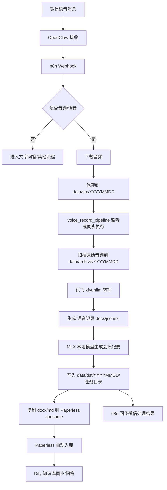

# 本地知识库助手工作流程设计

本文结合 `需求.docx`、当前目录模块和 `depoly.sh` 部署脚本，设计一套基于 OpenClaw、n8n、Dify、Paperless-ngx、MLX 本地模型服务与讯飞转写脚本的本地知识库助手工作流。

## 1. 设计目标

### 1.1 当前优先目标

先落地一个稳定闭环：

```text
微信收到语音
  -> OpenClaw 转发给 n8n
  -> n8n 保存音频到 Work/data/src/YYYYMMDD
  -> 本地流水线自动转写
  -> 生成 语音记录.docx
  -> 本地 MLX 模型生成 语音记录.会议纪要.md
  -> 输出到 Work/data/dst/YYYYMMDD
  -> Paperless-ngx 归档
  -> Dify 知识库可检索
  -> 微信回传处理结果
```

### 1.2 总体建设目标

根据需求文档，系统最终应成为一个“本地超级秘书/研究员”：

- 自动归集微信、NAS、手机、电脑上的音频、文档和资料。
- 自动识别项目/条线并归档，不确定时主动询问确认。
- 本地模型承担基础工作，如转写后摘要、分类、打标签、初步检索。
- 线上大模型只用于高质量最终报告等核心场景，减少 token 成本。
- Paperless-ngx 保存原始资料和 OCR 结果。
- Dify 承担知识库问答、检索增强和对话式交互。
- n8n 负责流程编排、定时任务、通知和异常重试。
- OpenClaw 负责微信入口和微信回传。

## 2. 系统分层

```text
交互层
  OpenClaw / 微信

编排层
  n8n

处理层
  tools/kb_assistant/voice_record_pipeline.py
  tools/transvideo/xfyunllm/Ifasr.py
  MLX 本地模型接口

知识层
  Paperless-ngx
  Dify Knowledge
  本地文件目录 Work/data

基础设施层
  Docker
  MLX / supervisor
  Mac Studio
  NAS / 本地磁盘
```

各组件职责：

| 组件              | 职责                           | 当前状态                             |
| --------------- | ---------------------------- | -------------------------------- |
| OpenClaw        | 接收微信消息、回发结果                  | 作为微信入口接入 n8n                     |
| n8n             | 工作流编排、文件保存、通知、异常重试           | 已由 `depoly.sh` 部署                |
| Dify            | 知识库问答、后续报告生成入口               | 已由 `depoly.sh` 部署                |
| Paperless-ngx   | 文档归档、OCR、全文检索                | 已由 `depoly.sh`/compose 配置        |
| MLX 本地模型服务     | 本地大模型服务，以 OpenAI 兼容接口暴露         | 由 `models/mlx/sup*.ini` 管理        |
| 70B/27B/1.5B 模型 | 本地会议纪要、摘要、分类和问答                | 通过 MLX server 调用                 |
| xfyunllm        | 讯飞语音转写，输出 docx/json/txt      | 已存在于 `tools/transvideo/xfyunllm` |
| kb\_assistant   | 目录监听、归档、调用 ASR/LLM/Paperless | 新增模块                             |

## 3. 目录规范

### 3.1 输入目录

```text
~/Work/data/src/YYYYMMDD/
```

用途：

- n8n 将 OpenClaw 收到的微信音频保存到这里。
- 监听脚本只扫描当天目录。
- 文件命名建议：`微信消息ID_发送人_时间戳.扩展名`。

示例：

```text
~/Work/data/src/20260428/wxmsg_abc123_张三_143210.amr
```

### 3.2 原始文件归档目录

```text
~/Work/data/archive/YYYYMMDD/
```

用途：

- 音频被处理前自动移动到该目录。
- 避免监听目录重复处理。
- 保留原始微信音频，便于回溯。

### 3.3 处理结果目录

```text
~/Work/data/dst/YYYYMMDD/<任务名>/
```

每条语音生成一个独立任务目录：

```text
~/Work/data/dst/20260428/20260428_143255_wxmsg_abc123/
├── 语音记录.docx
├── 语音记录.txt
├── 语音记录.json
├── 语音记录.会议纪要.md
├── metadata.json
└── _asr/
```

### 3.4 Paperless 导入目录

默认：

```text
~/Work/paperless-ngx/consume/
```

如果实际部署使用的是 `tools/paperless-ngx/consume/`，启动流水线时指定：

```bash
python3 ~/Work/tools/kb_assistant/voice_record_pipeline.py --watch \
  --paperless-consume-dir ~/Work/tools/paperless-ngx/consume
```

## 4. 主流程：微信语音到知识库



## 5. n8n 工作流设计

### 5.1 工作流 A：微信消息入口

触发方式：OpenClaw 调用 n8n Webhook。

建议节点：

| 顺序 | n8n 节点             | 作用                             |
| -- | ------------------ | ------------------------------ |
| 1  | Webhook            | 接收 OpenClaw 微信消息               |
| 2  | HTTP Request       | 调本地 API 标准化消息并生成保存路径          |
| 3  | IF                 | 判断消息类型：语音/文件/文字                |
| 4  | HTTP Request       | 下载微信音频文件                       |
| 5  | Write Binary File  | 写入 `/work/data/src/YYYYMMDD/`   |
| 6  | Respond to Webhook | 立即回复“已接收，正在处理”                 |
| 7  | 监听脚本              | 后台自动转写、总结、归档                  |

标准化 OpenClaw 消息并生成保存路径：

```text
POST http://host.docker.internal:8765/openclaw/normalize
```

可导入工作流模板：

```text
tools/kb_assistant/n8n_workflows/openclaw_voice_ingest.json
tools/kb_assistant/n8n_workflows/openclaw_result_notify.json
```

OpenClaw 给 n8n 的推荐消息体：

```json
{
  "message_id": "wx_msg_001",
  "from_user": "张三",
  "chat_name": "项目群",
  "message_type": "voice",
  "file_url": "http://openclaw.local/files/wx_msg_001.amr",
  "file_name": "wx_msg_001.amr",
  "created_at": "2026-04-28 14:32:10"
}
```

n8n 保存文件路径建议：

```text
~/Work/data/src/{{ $now.format('yyyyMMdd') }}/{{ message_id }}_{{ from_user }}.{{ ext }}
```

### 5.2 同步模式与异步模式

推荐先用异步模式，稳定后再决定是否做同步。

| 模式   | 做法                        | 优点                  | 风险                |
| ---- | ------------------------- | ------------------- | ----------------- |
| 异步模式 | n8n 只保存音频，后台监听脚本处理        | 不阻塞微信回调，长音频更稳       | 需要单独做结果通知         |
| 同步模式 | n8n 保存后直接 Execute Command | 流程直观，metadata 可立即返回 | 长音频可能超时，n8n 执行时间长 |

建议生产流程：

1. n8n 收到语音后立即回复：“已收到，正在转写和生成会议纪要。”
2. 后台监听脚本处理音频。
3. 结果通知工作流扫描 `metadata.json`。
4. 处理完成后通过 OpenClaw 回发文件路径或文件。

### 5.3 工作流 B：结果通知

触发方式：Cron 每 1 分钟扫描。

节点：

| 顺序 | n8n 节点          | 作用                                     |
| -- | --------------- | -------------------------------------- |
| 1  | Cron            | 每分钟触发                                  |
| 2  | HTTP Request    | 调本地 API 查找未通知任务                       |
| 3  | IF              | 判断是否有待通知任务                             |
| 4  | HTTP Request    | 调用 OpenClaw 回发结果                       |
| 5  | HTTP Request    | 调本地 API 写入 `.notified`                 |

列出未通知任务：

```text
GET http://host.docker.internal:8765/notifications?include_failed=1
```

标记已通知：

```text
POST http://host.docker.internal:8765/notifications/mark
```

回发内容建议：

```text
语音记录已生成：
- 转写文档：/Users/jianfeisu/Work/data/dst/YYYYMMDD/<任务名>/语音记录.docx
- 会议纪要：/Users/jianfeisu/Work/data/dst/YYYYMMDD/<任务名>/语音记录.会议纪要.md
- 已提交 Paperless 归档
```

## 6. 语音处理流水线

脚本：

```text
python3 ~/Work/tools/kb_assistant/n8n_notify.py mark /path/to/metadata.json
```

职责：

1. 监听 `data/src/YYYYMMDD`。
2. 将收到的音频移动到 `data/archive/YYYYMMDD`。
3. 调用 `tools/transvideo/xfyunllm/Ifasr.py`：
   - 转 WAV。
   - 上传讯飞。
   - 轮询结果。
   - 生成 txt/json/docx。
4. 复制转写结果为固定文件名：
   - `语音记录.docx`
   - `语音记录.txt`
   - `语音记录.json`
5. 调用 MLX 本地模型接口：
   - 1.5B URL：`http://127.0.0.1:9080/v1`
   - 27B URL：`http://127.0.0.1:9081/v1`
   - 70B URL：`http://127.0.0.1:9082/v1`
   - 模型由 `models/mlx/sup*.ini` 中的 `command` 指定
   - 输出：`语音记录.会议纪要.md`
6. 如果配置了 Dify API Key 和 Dataset ID，自动把会议纪要导入 Dify 知识库。
7. 写入 `metadata.json`。
8. 复制 docx 和 md 到 Paperless consume 目录。

启动方式：

```bash
python3 ~/Work/tools/kb_assistant/voice_record_pipeline.py --watch
```

单次调试：

```bash
python3 ~/Work/tools/kb_assistant/voice_record_pipeline.py \
  ~/Work/data/src/$(date +%Y%m%d)/demo.wav \
  --llm-url http://127.0.0.1:9082/v1 \
  --llm-model mlx-community/DeepSeek-R1-Distill-Llama-70B-4bit
```

## 7. Dify 工作流设计

Dify 不建议放在第一版语音转写主链路里，第一版由脚本直接调用 MLX 本地模型接口，减少不确定性。Dify 重点承担知识库问答和后续报告生成。

### 7.1 Dify 应用 1：本地知识库问答

用途：

- 微信文字提问。
- n8n 调用 Dify API。
- Dify 检索会议纪要、文档、项目资料后回答。

流程：

```text
微信文字问题
  -> OpenClaw
  -> n8n
  -> Dify Chatflow / App API
  -> Dify 检索知识库
  -> MLX 本地模型或线上模型生成回答
  -> n8n 回传微信
```

### 7.2 Dify 知识库导入策略

第一阶段：

- 流水线通过 Dify Knowledge API 自动导入 `语音记录.会议纪要.md`。
- 导入重要项目文档。
- 原始 `语音记录.docx` 由 Paperless 保存。

配置环境变量：

```bash
export DIFY_API_URL="http://127.0.0.1/v1"
export DIFY_API_KEY="你的 Dify Knowledge API Key"
export DIFY_DATASET_ID="你的知识库 Dataset ID"
```

第二阶段：

- n8n 定时扫描 `data/dst`，发现 `dify_error.json` 后发起重试或提醒人工处理。
- 对历史会议纪要做批量补导入。
- 将 Dify 文档 ID、项目标签和来源文件路径同步写回 `metadata.json`。

### 7.3 模型分工

| 任务      | 推荐模型                 | 原因               |
| ------- | -------------------- | ---------------- |
| 会议纪要    | 本地 MLX 70B 模型          | 隐私优先，成本可控        |
| 简单分类    | 本地 MLX 1.5B/27B 或 Dify | 高频任务，避免 token 成本 |
| 知识库问答   | Dify + 本地模型          | 可控、可追溯           |
| 高质量报告终稿 | 线上大模型，可选             | 只在核心产出使用         |

## 8. Paperless-ngx 工作流设计

Paperless-ngx 负责“资料原件归档”和全文检索，不替代 Dify 的语义问答。

入库文件：

- `语音记录.docx`
- `语音记录.会议纪要.md`
- 后续可加入原始 PDF、Word、扫描件。

建议标签：

| 标签         | 来源             |
| ---------- | -------------- |
| `微信语音`     | 固定标签           |
| `会议纪要`     | 固定标签           |
| `YYYYMMDD` | 日期             |
| 项目名        | 后续分类模型或人工确认    |
| 发送人        | OpenClaw 消息元数据 |

第一版可以先通过目录入库，不急于调用 Paperless API。后续再用 API 写入标签、通信方、文档类型和自定义字段。

## 9. 分类与主动确认机制

需求文档强调“28 个项目/条线自动识别，不确定时主动询问”。建议作为第二阶段建设。

### 9.1 项目字典

建立一个项目配置文件：

```text
tools/kb_assistant/projects.yml
```

内容示例：

```yaml
projects:
  - id: snky
    name: 省农科院合作
    keywords: ["省农科院", "农科院", "合作项目"]
    aliases: ["农科院项目"]
  - id: superior_docs
    name: 上级文件
    keywords: ["上级", "通知", "文件", "要求"]
```

### 9.2 分类流程

```text
会议纪要生成
  -> 本地模型判断项目/条线
  -> 置信度 >= 阈值：自动打标签、归档
  -> 置信度 < 阈值：微信询问用户确认
  -> 用户回复确认/纠正
  -> 写入分类反馈记录
```

### 9.3 纠错记录

建议保存：

```text
~/Work/data/feedback/classification_feedback.jsonl
```

每条记录：

```json
{
  "task_id": "20260428_143255_wxmsg_abc123",
  "model_guess": "省农科院合作",
  "user_correction": "上级文件",
  "reason": "用户微信纠正",
  "created_at": "2026-04-28 15:01:00"
}
```

后续用于优化项目字典和分类提示词。

## 10. 异常处理设计

| 异常             | 处理方式                        | 通知            |
| -------------- | --------------------------- | ------------- |
| OpenClaw 未提供文件 | n8n 标记失败                    | 微信提示“未收到音频文件” |
| 音频下载失败         | n8n 重试 3 次                  | 失败后通知         |
| 文件格式不支持        | 流水线拒绝处理                     | 回发支持格式        |
| 讯飞上传失败         | 保留 archive 原文件，写 error.json | 微信通知转写失败      |
| 讯飞轮询超时         | 可手动重试                       | 微信通知超时        |
| MLX 模型不可用      | 仅保留语音记录.docx，不生成纪要          | 微信通知模型不可用     |
| Paperless 未消费  | 文件仍保留在 dst                  | n8n 后续重试      |
| Dify 导入失败      | 不影响原始文件                     | 标记待重试         |

建议每个任务目录增加：

```text
status.json
error.log
.notified
```

当前流水线已实现：

- `status.json`：记录 `processing`、`transcribing`、`summarizing`、`importing`、`completed`、`failed` 状态。
- `error.json` / `error.log`：记录失败原因和 traceback。
- `.notified`：由 `n8n_notify.py mark` 在微信通知成功后写入。

## 11. 安全与成本控制

### 11.1 数据安全

- 微信音频、转写文本、会议纪要全部保存在本地 `Work/data`。
- Paperless 和 Dify 部署在本地 Docker。
- 会议纪要由本地 MLX 模型生成，模型服务通过 `models/mlx/sup*.ini` 管理。
- 讯飞转写会上传音频到讯飞接口，这一点不是纯本地，需要在隐私要求高的场景中特别标记。

### 11.2 成本控制

- 高频任务：本地模型处理。
- 最终报告、重要汇报：可选线上大模型。
- n8n 中为线上模型调用设置人工确认节点。
- 会议纪要默认不走线上 API。

## 12. 推荐实施阶段

### 第一阶段：语音闭环

目标：微信语音自动生成转写文档和会议纪要。

范围：

- OpenClaw -> n8n。
- n8n 保存音频到 `data/src/YYYYMMDD`。
- `voice_record_pipeline.py --watch`。
- 生成 `语音记录.docx` 和 `语音记录.会议纪要.md`。
- Paperless 自动归档。
- 微信回传处理结果。

验收标准：

- 发送 1 条微信语音，能在 `data/dst/YYYYMMDD` 找到完整结果。
- Paperless 中能检索到对应文档。
- 微信收到完成通知。

### 第二阶段：知识库问答

目标：能通过微信问“某个会议说了什么”“某项目最近进展是什么”。

范围：

- Dify 建知识库。
- n8n 导入会议纪要到 Dify。
- 微信文字问题调用 Dify API。
- 回答带来源文件路径。

验收标准：

- 能检索最近会议纪要。
- 回答能引用来源。

### 第三阶段：项目自动分类

目标：28 个项目/条线自动识别和纠错学习。

范围：

- 项目字典。
- 分类提示词。
- 低置信度微信确认。
- 用户纠错记录。
- Paperless/Dify 标签同步。

验收标准：

- 常见项目能自动分类。
- 不确定内容会主动询问。
- 用户纠错后有记录可追溯。

### 第四阶段：报告生成

目标：生成周报、月报、汇报材料和研究报告。

范围：

- Dify Workflow 或 n8n 编排。
- 从 Dify/Paperless/本地目录检索资料。
- 本地模型生成初稿。
- 可选线上大模型润色终稿。

验收标准：

- 输入“生成某项目本周周报”，系统能产出结构化文档。
- 报告能追溯引用资料。

## 13. 当前可立即执行的启动命令

启动基础服务：

```bash
bash ~/Work/depoly.sh
```

启动语音监听：

```bash
~/Work/tools/kb_assistant/bin/start_api.sh
~/Work/tools/kb_assistant/bin/start_watcher.sh
```

如果 Paperless consume 目录使用 tools 版本：

```bash
~/Work/tools/kb_assistant/bin/start_watcher.sh \
  --paperless-consume-dir ~/Work/tools/paperless-ngx/consume
```

测试单个音频：

```bash
mkdir -p ~/Work/data/src/$(date +%Y%m%d)
python3 ~/Work/tools/kb_assistant/voice_record_pipeline.py \
  ~/Work/data/src/$(date +%Y%m%d)/demo.wav \
  --llm-url http://127.0.0.1:9082/v1 \
  --llm-model mlx-community/DeepSeek-R1-Distill-Llama-70B-4bit
```

## 14. 第一版最小可用 n8n 配置

最小可用只需要两个工作流：

### 工作流 1：接收语音

```text
Webhook
  -> IF message_type == voice
  -> HTTP Request 调本地 API 生成保存路径
  -> HTTP Request 下载 file_url
  -> Write Binary File 到 /work/data/src/YYYYMMDD/
  -> OpenClaw 回发“已收到，正在处理”
```

### 工作流 2：回发结果

```text
Cron 每分钟
  -> HTTP Request 调本地 API 查找未通知任务
  -> HTTP Request 调 OpenClaw 回发结果
  -> HTTP Request 调本地 API 写 .notified
```

这样第一版不依赖复杂 API，核心链路最短，符合“优先集成成熟方案，不重新造轮子”的要求。
